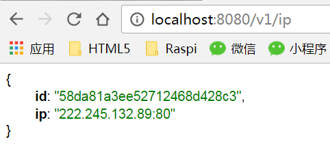
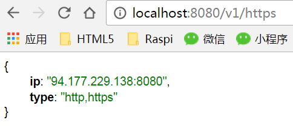

# Golang实现的IP代理池

> 采集免费的代理资源为爬虫提供有效的IP代理

[](https://travis-ci.org/henson/proxypool) [](https://goreportcard.com/report/github.com/henson/proxypool)

## Stargazers over time

[](https://starchart.cc/henson/proxypool)

## 版本更新

- 2019年3月28日 v2.3 感谢 [@sndnvaps](https://github.com/sndnvaps)
  - 修复数据库中不存在https代理源的时候查询出错的问题。解决[问题#31](https://github.com/henson/proxypool/issues/31)
- 2019年2月2日 v2.2 感谢 [@sndnvaps](https://github.com/sndnvaps)
  - 添加MAC Darwin平台的支持
  - 添加完全的 sqlite3 支持
  - 添加新代理平台【feiyi，89ip】
  - fix一个bug【当数据库中无数据时，不能写入数据】
- 2018年8月17日 v2.1 感谢 [@harrybi](https://github.com/harrybi)
  - 对代理可用性的验证，增加speed字段，验证代理的速度（毫秒）
  - 调用API获取代理IP时自动过滤掉慢的代理（>=1s）
- 2018年7月17日 v2.0 感谢 [@sndnvaps](https://github.com/sndnvaps)
  - 使用 xorm 来处理数据库，支持 mysql、mssql、postgres 和 sqlite3
  - 更新相应爬虫程序
  - 加入日志
- 2017年3月30日 v1.0
  - 采用 mongo 作为数据持久化
  - 结构简洁，适合二次开发

### 1、代理池设计

　　代理池由四部分组成：

- Getter：

　　代理获取接口，目前有**9**个免费代理源，每调用一次就会抓取这些网站最新的100个代理放入Channel，可自行[添加额外的代理获取接口](#4添加自定义代理采集接口)；

- Channel：

　　临时存放采集来的代理，通过访问稳定的网站去验证代理的有效性，有效则存入数据库；

- Schedule：

　　用定时的计划任务去检测数据库中代理IP的可用性，删除不可用的代理。同时也会主动通过Getter去获取最新代理；

- Api：

　　代理池的访问接口，提供get接口输出JSON，方便爬虫直接使用。

### 2、代码实现

- Api：

　　api接口相关代码，提供`get`接口，输出JSON；

- Getter：

　　代理获取接口，目前抓取这九个网站的免费代理，当然也支持自己扩展代理接口；

1. ~~[快代理](http://www.kuaidaili.com)~~
2. [代理66](http://www.66ip.cn)
3. [IP181](http://www.ip181.com)
4. ~~[有代理](http://www.youdaili.net/Daili/http/)~~
5. ~~[西刺代理](http://www.xicidaili.com/nn/)~~
6. ~~[guobanjia](http://www.goubanjia.com/free/gngn/index)~~
7. ~~[讯代理](http://www.xdaili.cn/freeproxy.html)~~
8. ~~[无忧代理](http://www.data5u.com/free/index.shtml)~~
9. [Proxylist+](https://list.proxylistplus.com)

- Pkg：

　　存放一些公共的模块、方法或函数；

- 其他：

　　配置文件:conf/app.ini，数据库、日志配置和代理获取接口配置；

```ini
; App name
APP_NAME = ProxyPool

[server]
HTTP_ADDR = 0.0.0.0
HTTP_PORT = 3000
;Session expires time
SESSION_EXPIRES =

[database]
; Either "mysql", "postgres" or "sqlite3", you can connect to TiDB with MySQL protocol
DB_TYPE = postgres
HOST = 127.0.0.1:5432
NAME = ProxyPool
USER = postgres
PASSWD =
; For "postgres" only, either "disable", "require" or "verify-full"
SSL_MODE = disable
; For "sqlite3" and "tidb", use absolute path when you start as service
PATH = data/ProxyPool.db

[log]
; Can be "console" and "file", default is "console"
; ; ; Use comma to separate multiple modes, e.g. "console, file"
MODE       = file
; Buffer length of channel, keep it as it is if you don't know what it is.
BUFFER_LEN = 100
; Either "Trace", "Info", "Warn", "Error", "Fatal", default is "Trace"
LEVEL      = Info
; Root path of log files, align will fill it automatically.
ROOT_PATH  =  

; For "console" mode only
[log.console]
; leave empty to inherit
LEVEL = Trace

; For "file" mode only
[log.file]
; leave empty to inherit
LEVEL          = Info
; This enables automated log rotate (switch of following options)
LOG_ROTATE     = true
; Segment log daily
DAILY_ROTATE   = true
; Max size shift of single file, default is 28 means 1 << 28, 256MB
MAX_SIZE_SHIFT = 28
; Max line number of single file
MAX_LINES      = 1000000
; Expired days of log file (delete after max days)
MAX_DAYS       = 7

[log.xorm]
; Enable file rotation
ROTATE = true
; Rotate every day
ROTATE_DAILY = true
; Rotate once file size excesses x MB
MAX_SIZE = 100
; Maximum days to keep logger files
MAX_DAYS = 3

[security]
INSTALL_LOCK = false
```

### 3、安装及使用

因为有些代理网站使用了加密页面、混淆代码等反爬技术，要正确采集到代理数据得用到 [PhantomJS](http://phantomjs.org/) ，必须提前先装好。

另外，本项目用到的依赖库有：
```
github.com/go-clog/clog
github.com/go-ini/ini
github.com/go-xorm/xorm
github.com/go-xorm/core
github.com/go-sql-driver/mysql
github.com/lib/pq
github.com/Aiicy/htmlquery
github.com/PuerkitoBio/goquery
github.com/parnurzeal/gorequest
github.com/nladuo/go-phantomjs-fetcher
```

下载本项目：
```
go get -u github.com/henson/proxypool
```

然后配置好相应的app.ini并启动：
```
go build
./ProxyPool
```

随机输出可用的代理：
```
GET http://localhost:8080/v2/ip
```


随机输出HTTPS代理：
```
GET http://localhost:8080/v2/https
```


### 4、添加自定义代理采集接口

其实很简单，只需要在getter包下新增一个采集函数（如例子的Data5u()），甚至可以不需要新建一个go文件（新建文件是为了方便归档采集函数，如例子5u.go）。

```golang
// 5u.go
// Data5u get ip from data5u.com
func Data5u() (result []*models.IP) {
    //处理逻辑
    ...
    log.Println("Data5u done.")
    return
}
```

然后在main.go的run函数中添加、删除或注释掉该采集函数的调用即可。

```golang
func run(ipChan chan<- *models.IP) {
    var wg sync.WaitGroup
    funs := []func() []*models.IP{
        getter.Data5u,
        getter.IP66,
        getter.KDL,
        getter.GBJ,
        getter.Xici,
        getter.XDL,
        //getter.IP181,
        //getter.YDL,
        getter.PLP,
    }
    ...
}
```

### 5、异常恢复

之前，偶尔会有朋友跟我反映程序无法编译，经过检查发现都是代理网站发生了变化（或修改了页面或关闭了网站），以致于采集程序原先设计的爬虫不能正常工作而导致了错误的发生。为此，我修改了代码，加入了容错机制，即便爬虫出错了也不会影响到主体程序的运行。出错的采集进程会被主线程忽略，其它正常的采集进程仍将继续工作。

### 6、诚挚的感谢

- 首先感谢您的使用，如果觉得程序还不错也能帮助您解决实际问题，不妨添个赞以鼓励本人继续努力，谢谢！
- 如果您对程序有任何建议和意见，也欢迎提交issue。
- 当然，如果您愿意贡献代码和我一起改进本程序，那再好不过了。
